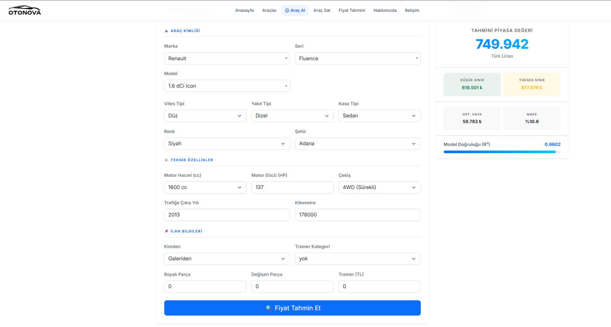
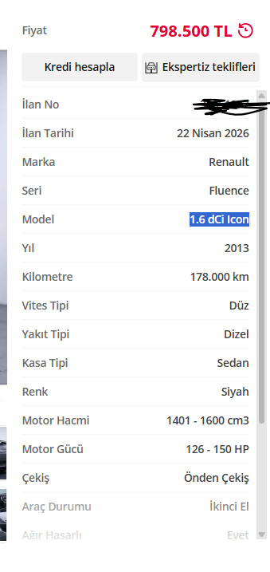

# 🚗 OtoNova

**AI destekli Türkiye ikinci el araç alım-satım platformu.**

> ⚠️ Proje aktif geliştirme aşamasındadır.

---

## 📌 Proje Hakkında

OtoNova; ikinci el araç ilanlarını listelemek, filtrelemek ve yapay zeka destekli fiyat analizi yapmak için geliştirilmiş bir web platformudur.

Kullanıcılar araç özelliklerini girerek saniyeler içinde tahmini piyasa değerini öğrenebilir. Model, 50 karar ağacından oluşan bir **Random Forest** algoritması kullanmakta olup **%96 R²** doğruluk oranına sahiptir.

---

## ✨ Özellikler

- 🔍 **İlan Pazarı** — Araçları marka, model, fiyat ve şehre göre filtrele
- 🤖 **AI Fiyat Tahmini** — Araç özelliklerine göre anlık piyasa değeri tahmini
- 📊 **Güven Aralığı** — %10–%90 yüzdelik dilim tabanlı alt/üst fiyat sınırı
- 📱 **Responsive Tasarım** — Mobil uyumlu modern arayüz
- 🔐 **Kullanıcı Sistemi** — Kayıt ve giriş sayfaları

---

## 🛠️ Kullanılan Teknolojiler

| Katman | Teknoloji |
|--------|-----------|
| Backend | Django 5 · Python 3.14 |
| ML | scikit-learn · pandas · numpy · joblib |
| Encoding | category_encoders (Target Encoding) |
| Frontend | Bootstrap 5.3 · Bootstrap Icons · Select2 |
| Veritabanı | SQLite (geliştirme) |

---

## 🤖 Model Detayları

| Metrik | Değer |
|--------|-------|
| Algoritma | Random Forest Regressor |
| R² Skoru | 0.9602 |
| MAE | ~59.783 TL |
| MAPE | %10.60 |
| Ağaç Sayısı | 50 |
| Hedef Kodlama | Marka · Model · Şehir |

Fiyat tahmini **log-uzayında** yapılır, sonuç `expm1()` ile gerçek TL değerine dönüştürülür. Güven aralığı 50 ağacın bireysel tahminlerinin yüzdelik dilimleriyle hesaplanır.

---

## 🚀 Kurulum

```bash
# Repoyu klonla
git clone https://github.com/yasincodes33/Otonova.git
cd Otonova

# Sanal ortam oluştur
python -m venv venv
venv\Scripts\activate        # Windows
# source venv/bin/activate   # Linux / macOS

# Bağımlılıkları yükle
pip install -r requirements.txt

# Sunucuyu başlat
python manage.py migrate
python manage.py runserver
```

> **Not:** Model dosyaları (`.pkl`) `.gitignore` kapsamındadır. Sunucuyu çalıştırmadan önce `ml_model/model/` klasörüne aşağıdaki dosyaları eklemelisin:
> - `arac_fiyat_modeli.pkl`
> - `target_encoder.pkl`

---

## 📁 Proje Yapısı

```
Otonova/
├── Otonova/              # Django ayarları ve URL yapılandırması
│   ├── settings.py
│   ├── urls.py
│   └── templates/
│       └── layout.html   # Ana şablon
├── ml_model/             # Uygulama ve ML kodu
│   ├── views.py          # Tahmin API'si ve sayfa görünümleri
│   ├── urls.py
│   ├── model/            # PKL dosyaları (git'e dahil değil)
│   ├── static/
│   │   ├── css/style.css
│   │   └── js/main.js
│   └── templates/tahmin/
│       ├── anasayfa.html
│       ├── index.html    # Fiyat tahmin formu
│       ├── arabalar.html
│       ├── giris.html
│       └── kayit.html
├── form_meta.json        # Dropdown seçenekleri
├── requirements.txt
└── manage.py
```

---

## 📸 Ekran Görüntüleri

### Fiyat Tahmini


### Örnek İlan Karşılaştırması


---

## 🗺️ Yol Haritası

- [ ] Kullanıcı kimlik doğrulama (giriş / kayıt backend)
- [ ] İlan ekleme ve yönetim paneli
- [ ] Gelişmiş arama ve filtreleme
- [ ] Favori ilan kaydetme
- [ ] PostgreSQL geçişi
- [ ] Deployment (Railway / Render)

---

## 👨‍💻 Geliştirici

**Yasin** — [@yasincodes33](https://github.com/yasincodes33)

*Dönem projesi olarak geliştirilmektedir.*

