<div align="center">

# OtoNova

### Yapay Zekâ Destekli İkinci El Araç Alım–Satım Platformu

Türkiye ikinci el otomobil piyasası için geliştirilmiş, her ilana **yapay zekâ ile üretilmiş adil fiyat etiketi** ekleyen Django tabanlı web platformu.

[](https://www.python.org/)
[](https://www.djangoproject.com/)
[](https://scikit-learn.org/)
[](https://www.docker.com/)
[](LICENSE)

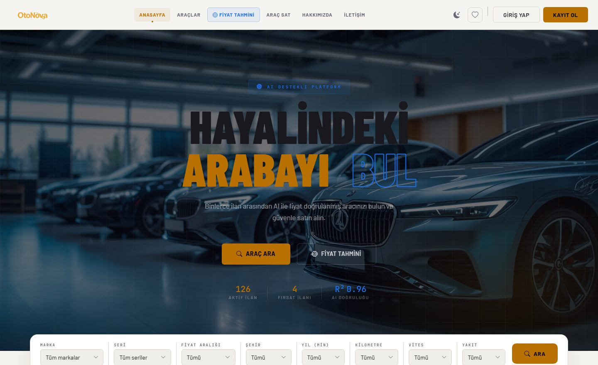

</div>

---

## İçindekiler

- [Proje Hakkında](#proje-hakkında)
- [Öne Çıkan Özellikler](#öne-çıkan-özellikler)
- [Ekran Görüntüleri](#ekran-görüntüleri)
- [Yapay Zekâ Modeli](#yapay-zekâ-modeli)
- [Sistem Mimarisi](#sistem-mimarisi)
- [Teknoloji Yığını](#teknoloji-yığını)
- [Kurulum](#kurulum)
- [Docker ile Çalıştırma](#docker-ile-çalıştırma)
- [Proje Yapısı](#proje-yapısı)
- [Yönetim Komutları](#yönetim-komutları)
- [Testler](#testler)
- [Yol Haritası](#yol-haritası)
- [Lisans](#lisans)

---

## Proje Hakkında

Türkiye, dünyanın en büyük ikinci el otomobil pazarlarından birine sahip; ancak bu piyasada **bilgi asimetrisi** yüksektir. Alıcı bir ilanın pahalı mı ucuz mu olduğunu, satıcı ise aracına doğru fiyatı biçip biçmediğini çoğu zaman bilemez.

OtoNova bu boşluğu iki işlevi tek platformda birleştirerek doldurur:

| | |
|---|---|
| **Fiyat Tahmin Motoru** | Kullanıcı aracının özelliklerini girer, model saniyeler içinde tahmini piyasa değerini ve güven aralığını hesaplar. |
| **Akıllı İlan Pazarı** | Her ilan, AI tahminiyle karşılaştırılarak `Fırsat` / `İyi Fiyat` / `Normal` / `Yüksek Fiyat` olarak etiketlenir ve bu etikete göre filtrelenebilir. |

> Konya Teknik Üniversitesi Bilgisayar Mühendisliği — Bilişim Teknolojileri Uygulaması dönem projesi olarak geliştirilmiştir.

---

## Öne Çıkan Özellikler

### Yapay Zekâ

- **Anlık fiyat tahmini** — RF + GB topluluk (ensemble) modeliyle log-uzayında tahmin, `expm1()` ile TL'ye dönüşüm
- **P10–P90 güven aralığı** — Random Forest içindeki her karar ağacının tahmininden yüzdelik dilim hesaplanır; dar aralık modelin o araca daha emin değer biçtiğini gösterir
- **Dönemsel kalibrasyon** — 2025 verisiyle eğitilen model, 2026 piyasasına marka bazlı düzeltme çarpanlarıyla uyarlanır (yeniden eğitim gerektirmez)
- **Segment bazlı hata payı** — Kullanıcıya sabit bir MAPE yerine, aracın fiyat dilimine özel gerçekçi hata payı gösterilir
- **Fırsat skoru (0–100)** — Fiyat sapması (60p) + tramer durumu (20p) + boya/değişen (10p) + yıllık ortalama km (10p) bileşenlerinden oluşan puan

### Platform

- **İlan pazarı** — 12 bağımsız filtre (marka, seri, model, şehir, vites, yakıt, yıl/km/fiyat aralığı, AI durumu) ve 7 sıralama seçeneği
- **İlan yayınlama** — Kademeli marka → seri → model → kasa seçimi, 13 panelli boya/değişen şeması, çoklu fotoğraf yükleme (PIL ile otomatik 1200×900 yeniden boyutlandırma)
- **Kullanıcı sistemi** — Kayıt, giriş, profil yönetimi, avatar yükleme, e-posta ile şifre sıfırlama
- **Favoriler** — AJAX tabanlı favoriye ekleme/çıkarma
- **Karanlık mod** — Tüm sayfalarda tema desteği
- **SEO** — Otomatik `sitemap.xml`, `robots.txt`, SEO dostu slug URL'ler, ilan sayfalarında JSON-LD şeması
- **Yönetim paneli** — Jazzmin ile özelleştirilmiş, Türkçe ve ikonlu Django admin

---

## Ekran Görüntüleri

### AI Fiyat Tahmini

Kullanıcı aracın özelliklerini girer; sağ panelde tahmini değer, P10–P90 güven aralığı, model doğruluğu ve o fiyat segmentine özel hata payı anlık olarak gösterilir.

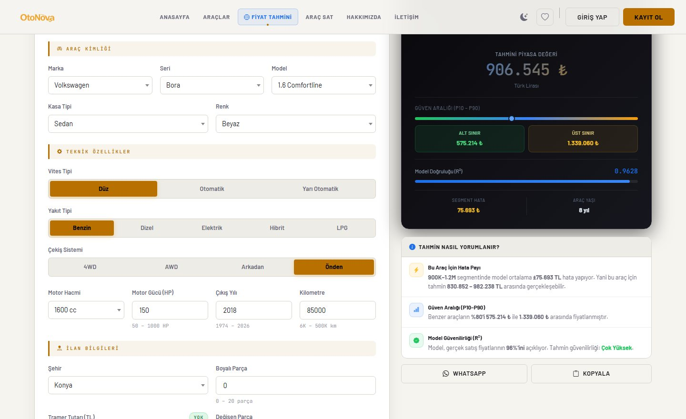

Tahmin formu, marka–seri–model–kasa zincirini birbirine bağlı açılır listelerle sunar:

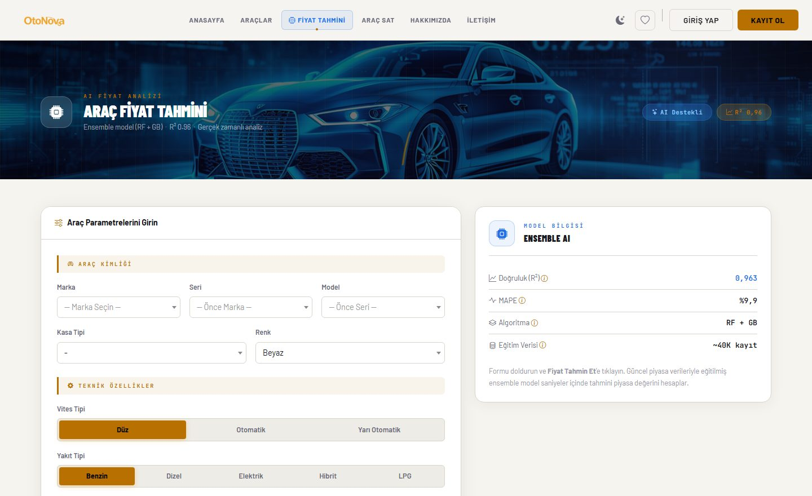

### İlan Pazarı

Her ilan kartında AI etiketi (`FIRSAT` / `İYİ FİYAT` / `NORMAL` / `YÜKSEK FİYAT`) ve ilan fiyatının AI tahmininden yüzde sapması görünür. Sol paneldeki filtreler bu etikete göre de arama yapmaya izin verir.

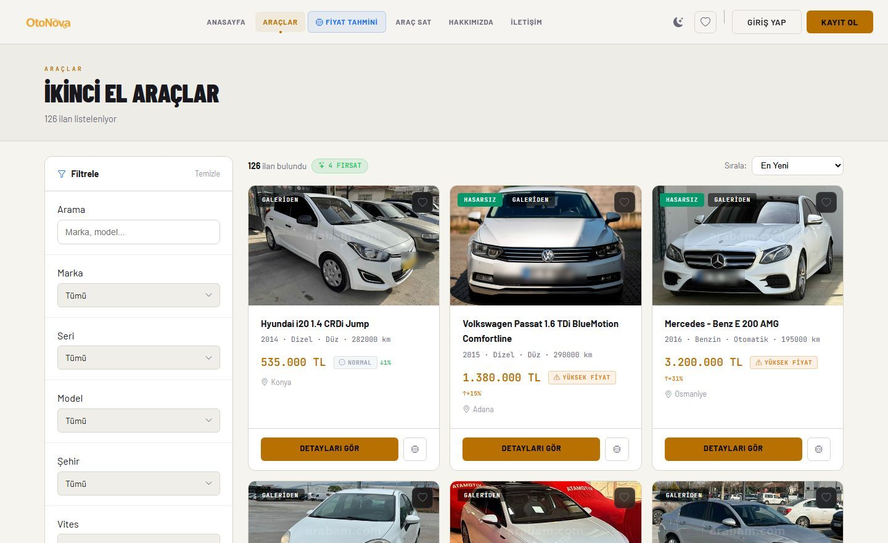

### İlan Detayı — AI Fiyat Analizi

İlan detayında AI tahmini, güven bandı üzerindeki fiyat konumu, model doğruluğu (R²) ve segment hata payı tek kartta toplanır.

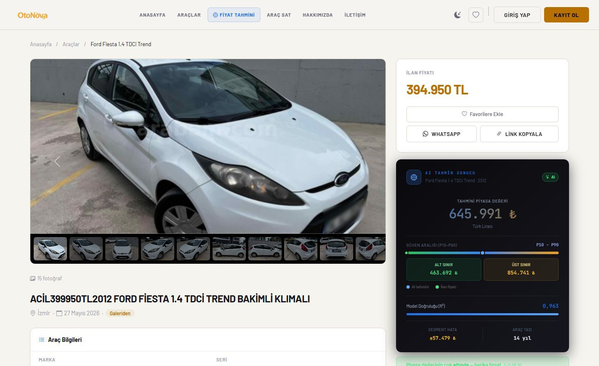

### Araç Satışı

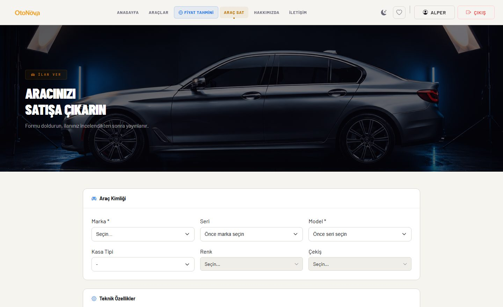

### Kullanıcı Hesabı

<table>
<tr>
<td width="50%">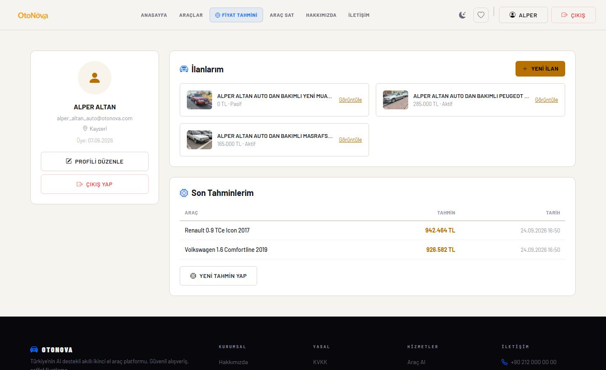<br><sub><b>Profil</b> — ilanlarım ve tahmin geçmişim</sub></td>
<td width="50%">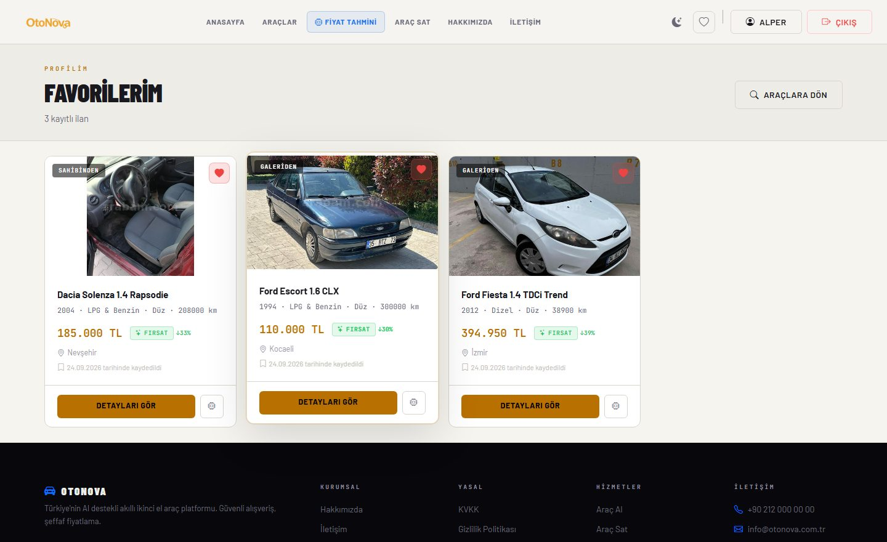<br><sub><b>Favoriler</b> — kaydedilen ilanlar</sub></td>
</tr>
<tr>
<td width="50%">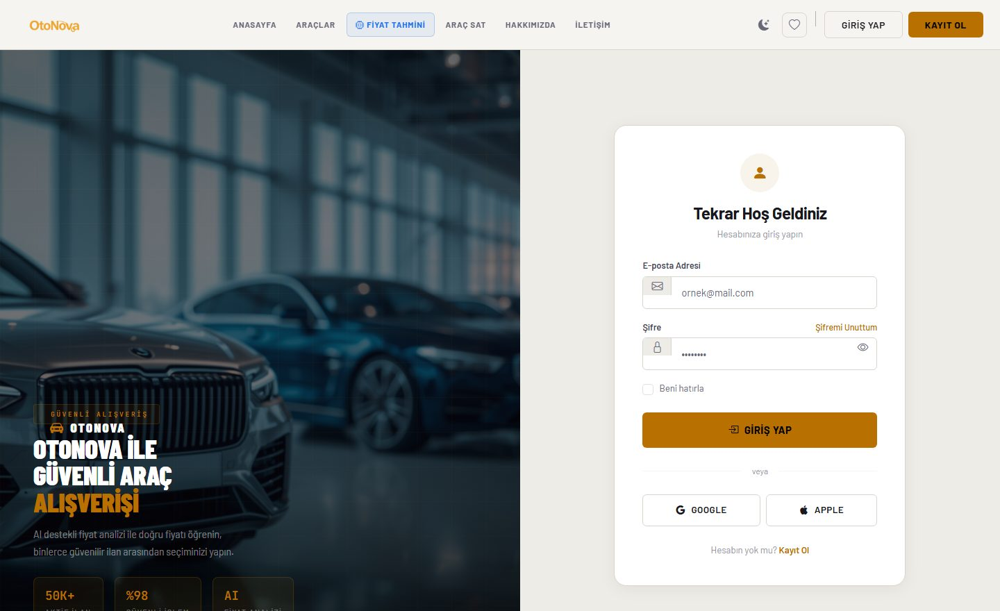<br><sub><b>Giriş</b></sub></td>
<td width="50%">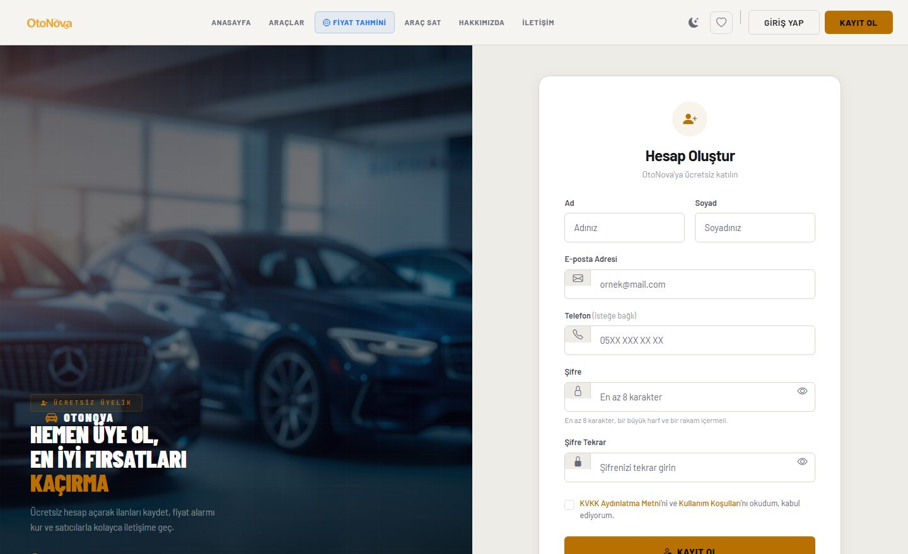<br><sub><b>Kayıt</b></sub></td>
</tr>
</table>

### Kurumsal Sayfalar

<table>
<tr>
<td width="50%">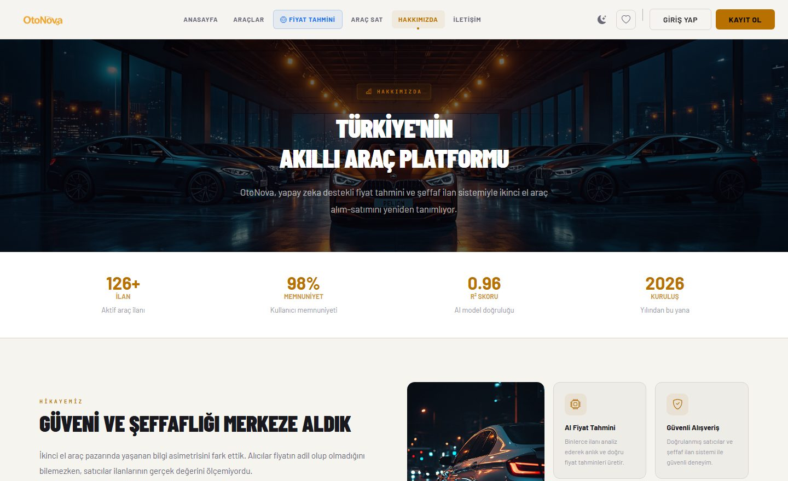<br><sub><b>Hakkımızda</b></sub></td>
<td width="50%">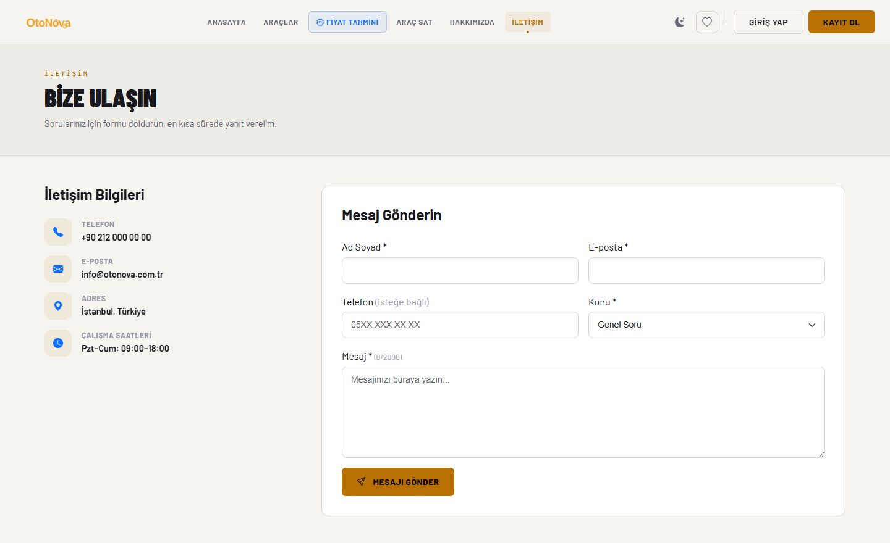<br><sub><b>İletişim</b></sub></td>
</tr>
</table>

### Yönetim Paneli

<table>
<tr>
<td width="50%">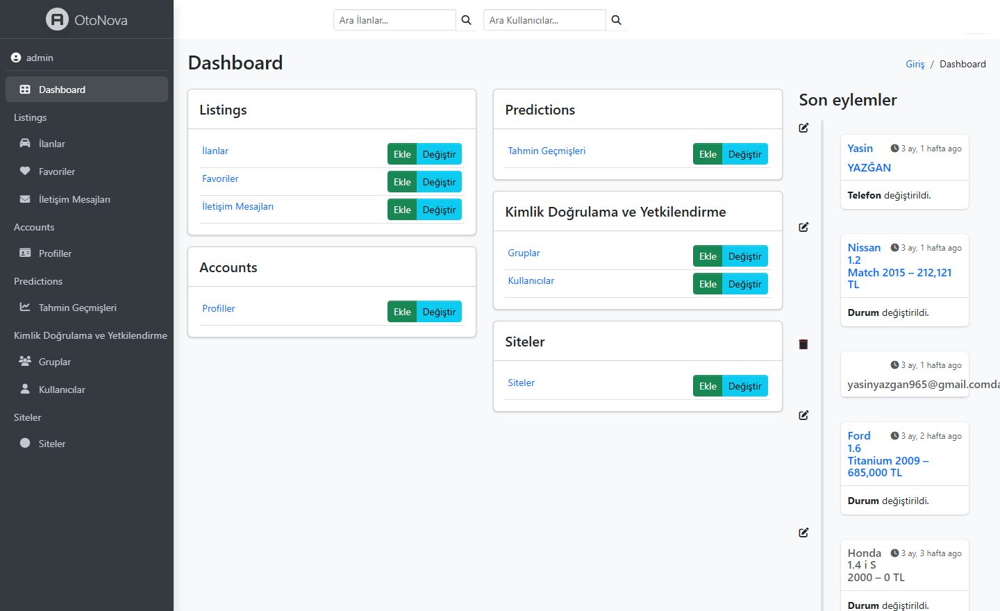<br><sub><b>Dashboard</b></sub></td>
<td width="50%">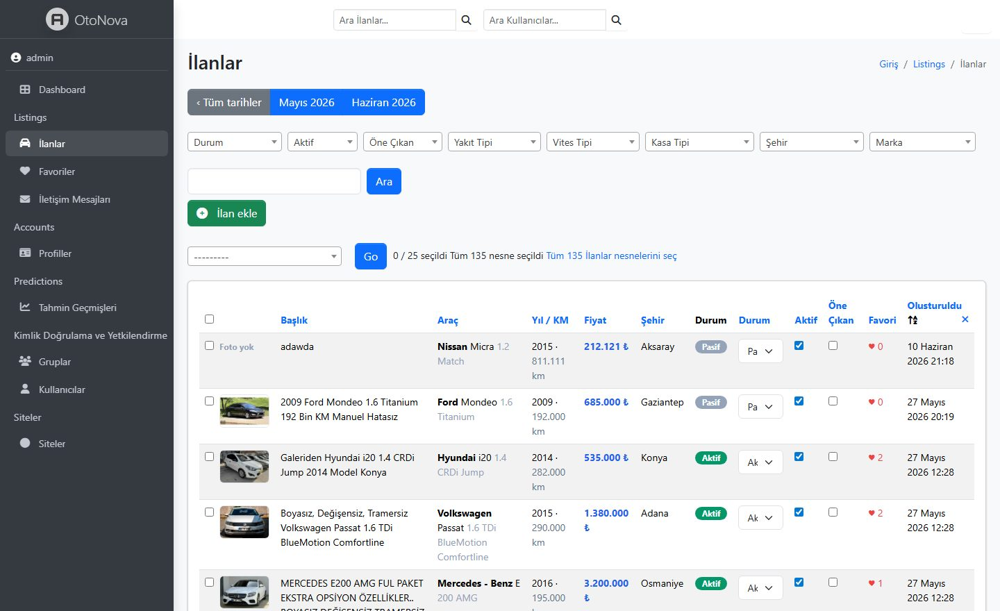<br><sub><b>İlan yönetimi</b></sub></td>
</tr>
</table>

---

## Yapay Zekâ Modeli

Platformda kullanılan model, ayrı bir depoda geliştirilmiştir:

> ### [yasincodes33 / Turkiye_2.el_arabalar_ml](https://github.com/yasincodes33/Turkiye_2.el_arabalar_ml)
>
> Veri temizleme, özellik mühendisliği, beş algoritmanın ve sekiz topluluk kombinasyonunun karşılaştırılması, dönemsel dağılım kayması analizi ve kalibrasyon çalışmasının tamamı notebook'lar hâlinde o depoda yer almaktadır.

Bu depo, eğitilmiş modeli **kullanan** tarafı içerir. Özet olarak:

| | |
|---|---|
| **Algoritma** | Random Forest (80 ağaç) + Gradient Boosting (150 ağaç) topluluğu, %50–%50 ağırlıklı |
| **Eğitim verisi** | 48.258 ilan (2025) · 55 özellik |
| **R² / MAE / MAPE** | `0,9628` · `57.608 TL` · `%9,87` (9.652 araçlık test seti) |
| **Hedef dönüşümü** | `log1p(fiyat)` ile eğitim, `expm1()` ile geri dönüşüm |
| **Kategorik kodlama** | Marka · Model · Şehir → Target Encoding; diğer kategorikler → One-Hot |
| **Kalibrasyon** | 980 araçlık 2026 veri setinden hesaplanan marka bazlı çarpanlar (`1,03` – `1,26`) |

### Django'ya Entegrasyon

`predictions/services.py` içindeki `MLService`, artefaktları **sınıf değişkeni tabanlı tembel yükleme** (lazy loading) ile yönetir. ~246 MB'lık model dosyası, Django süreci başladıktan sonra yalnızca ilk tahmin isteğinde bir kez belleğe alınır; sonraki tüm istekler aynı nesneyi kullanır.

```python
# predictions/services.py
class MLService:
    _model = None

    @classmethod
    def get_model(cls):
        if cls._model is None:
            cls._model = joblib.load(ARTIFACT_DIR / 'ensemble_rf_gb_best.pkl')
        return cls._model
```

**Tahmin akışı:**

```
Form verisi
   └─> build_input_df()          # 6 türetilmiş özellik: km_per_year, motor_verimlilik,
       │                         # hasar_skoru, log_km, motor_gucu_sq, tramer_bilinmiyor
       ├─> Target Encoding + One-Hot
       └─> reindex(feature_names)  # sütun sırası garantisi
   └─> 0.5 × RF.predict() + 0.5 × GB.predict()   (log-uzayı)
   └─> np.expm1()                                 (TL'ye dönüşüm)
   └─> × MARKA_CARPAN[marka]                      (dönemsel kalibrasyon)
   └─> RF ağaçlarından P10 / P90                  (güven aralığı)
   └─> TahminGecmisi kaydı + JSON yanıt
```

### Fiyat Etiketleri

| Etiket | Koşul | Anlamı |
|---|---|---|
| **Fırsat** | `fırsat_skoru ≥ 70` | Hem fiyat hem araç durumu avantajlı |
| **İyi Fiyat** | `sapma ≤ −%5` | AI tahmininin en az %5 altında |
| **Normal** | `−%5 < sapma ≤ +%10` | Adil piyasa fiyatı |
| **Yüksek Fiyat** | `sapma > +%10` | AI tahmininin %10'dan fazla üzerinde |

Eşik değerleri modelin MAPE'si (~%10) dikkate alınarak seçilmiştir: bunun altındaki sapmalar ölçüm belirsizliği, üzerindekiler gerçek fiyat farkı sayılır.

---

## Sistem Mimarisi

Proje, Django'nun MVT mimarisi üzerinde **sorumlulukları ayrılmış beş uygulamadan** oluşur:

| Uygulama | Sorumluluk | Temel Dosyalar |
|---|---|---|
| `core` | Paylaşılan soyut model ve şablon filtreleri | `models.py`, `templatetags/otonova_filters.py` |
| `accounts` | Kayıt, giriş, profil, şifre sıfırlama | `views.py`, `forms.py`, `signals.py` |
| `listings` | İlan yayınlama, listeleme, arama, favoriler, iletişim | `models.py`, `views.py`, `sitemaps.py` |
| `predictions` | AI tahmin formu, tahmin servisi, tahmin geçmişi | `services.py`, `utils.py`, `views.py` |
| `pages` | Ana sayfa, Hakkımızda, site haritası | `views.py`, `sitemaps.py` |

### Veritabanı Modelleri

Tüm modeller, `olusturuldu` / `guncellendi` alanlarını merkezî olarak sağlayan soyut `core.models.ZamanDamgasi` sınıfından türer.

| Model | Uygulama | Amaç |
|---|---|---|
| `ProfilModel` | accounts | Kullanıcı profili (telefon, şehir, avatar, biyografi) |
| `IlanModel` | listings | Araç ilanı — teknik ve ticari bilgiler + AI alanları |
| `IlanFoto` | listings | İlana ait fotoğraflar (sıra, kapak bayrağı) |
| `FavoriModel` | listings | Kullanıcı–ilan favori ilişkisi |
| `IletisimModel` | listings | İletişim formu mesajları |
| `TahminGecmisi` | predictions | Her AI tahmin isteğinin kaydı |

**Kritik tasarım kararları:**

- **UUID + slug** — `IlanModel`, tahmin edilemez bir `uuid` ile SEO dostu bir `slug` alanını birlikte tutar. Slug, `save()` içinde `{marka}-{model}-{yıl}-{uuid[:8]}` şablonundan üretilir.
- **AI alanlarının ilanda saklanması** — `ai_tahmin_fiyat`, `ai_sapma_yuzdesi` ve `firsat_skoru` ilan kaydında tutulur; böylece arama sonuçlarında AI'ya göre filtreleme yaparken her sayfa yüklenişinde modelin yeniden çalıştırılması gerekmez.
- **Bileşik indeksler** — `(is_active, durum)`, `(marka, model)`, `(yil, kilometre)`, `(sehir, durum)`, `(fiyat)`, `(firsat_skoru)` indeksleriyle filtreli sorgular tam tablo taramasından kurtulur.
- **Otomatik profil oluşturma** — `accounts/signals.py` içindeki `post_save` sinyali, her yeni `User` için otomatik `ProfilModel` yaratır.

### Güvenlik ve Ayar Mimarisi

Ayarlar üç dosyaya bölünmüştür: `base.py` (ortak), `dev.py` (geliştirme), `prod.py` (üretim).

- `SECRET_KEY` ve `ALLOWED_HOSTS` ortam değişkenlerinden okunur
- CSRF doğrulaması, `X-Frame-Options` (clickjacking), `SESSION_COOKIE_HTTPONLY`
- Üretimde: `SECURE_SSL_REDIRECT`, güvenli çerezler, 1 yıllık HSTS, WhiteNoise ile sıkıştırılmış statik dosya sunumu
- Dört katmanlı şifre doğrulaması (benzerlik, uzunluk, yaygınlık, sadece-rakam)
- Fotoğraf yüklemede MIME türü ve 5 MB boyut kontrolü

---

## Teknoloji Yığını

| Katman | Teknolojiler |
|---|---|
| **Backend** | Django 6.0 · Python 3.12+ |
| **Makine Öğrenmesi** | scikit-learn 1.8 · pandas · NumPy · joblib · category_encoders |
| **Frontend** | Bootstrap 5.3 · Bootstrap Icons · Select2 · Vanilla JS |
| **Veritabanı** | SQLite (geliştirme) |
| **Görsel İşleme** | Pillow |
| **Yönetim Paneli** | django-jazzmin |
| **Üretim** | Gunicorn · WhiteNoise · Docker |

---

## Kurulum

### Gereksinimler

- Python 3.12 veya üzeri
- Git ve [Git LFS](https://git-lfs.com/) — model dosyası (~246 MB) LFS ile saklanmaktadır

### Adımlar

```bash
# 1) Git LFS'i kur (bir kez yeterlidir)
git lfs install

# 2) Depoyu klonla — LFS dosyaları otomatik iner
git clone https://github.com/yasincodes33/Otonova.git
cd Otonova

# 3) Sanal ortam oluştur ve etkinleştir
python -m venv venv
venv\Scripts\activate          # Windows
# source venv/bin/activate     # Linux / macOS

# 4) Bağımlılıkları yükle
pip install -r requirements.txt

# 5) Ortam değişkenlerini hazırla
copy .env.example .env         # Windows
# cp .env.example .env         # Linux / macOS

# 6) Veritabanını hazırla ve sunucuyu başlat
python manage.py migrate
python manage.py runserver
```

Uygulama <http://127.0.0.1:8000> adresinde çalışır.

> **Model dosyası inmediyse:** `git lfs pull` komutunu çalıştırın. `predictions/artifacts/ensemble_rf_gb_best.pkl` dosyasının boyutu ~246 MB olmalıdır; birkaç KB ise yalnızca LFS işaretçisi inmiş demektir.

### Demo Verisi

Depo, **126 aktif araç ilanı** içeren hazır bir `db.sqlite3` ile gelir; klonladıktan sonra platformu dolu hâlde görebilirsiniz.

Yönetim paneline girmek için kendi hesabınızı oluşturun:

```bash
python manage.py createsuperuser
```

> **Not:** İlan fotoğrafları (`media/`, ~300 MB) depo boyutunu makul tutmak için dâhil edilmemiştir; bu nedenle ilan kartlarındaki görseller yerel kurulumda boş görünür. Yukarıdaki ekran görüntüleri uygulamanın fotoğraflarla birlikte gerçek görünümünü yansıtmaktadır.

---

## Docker ile Çalıştırma

```bash
docker compose up --build
```

`entrypoint.sh`, konteyner başlarken migration'ları uygular ve uygulamayı Gunicorn ile 8000 portunda ayağa kaldırır. Statik dosyalar imaj derlenirken `collectstatic` ile toplanır.

```bash
# Üretim için kendi anahtarınızla
SECRET_KEY="uzun-ve-rastgele-bir-anahtar" docker compose up -d
```

---

## Proje Yapısı

```
Otonova/
├── Otonova/                        # Proje konfigürasyonu
│   ├── settings/
│   │   ├── base.py                 # Ortak ayarlar
│   │   ├── dev.py                  # Geliştirme
│   │   └── prod.py                 # Üretim (SSL, HSTS, SMTP)
│   ├── static/                     # Global CSS / JS / görseller
│   ├── templates/                  # layout.html, 404, 500, robots.txt
│   └── urls.py                     # Kök URL yapılandırması + sitemap
│
├── core/                           # Paylaşılan altyapı
│   ├── models.py                   # ZamanDamgasi (soyut taban)
│   └── templatetags/               # para filtresi (3200000 → 3.200.000)
│
├── accounts/                       # Kullanıcı yönetimi
│   ├── models.py  views.py  forms.py  signals.py
│   └── templates/accounts/         # giris · kayit · profil · sifre/
│
├── listings/                       # İlan yönetimi
│   ├── models.py                   # IlanModel · IlanFoto · FavoriModel · IletisimModel
│   ├── views.py  forms.py  sitemaps.py
│   └── templates/listings/         # arabalar · ilan_detay · satis · favoriler
│
├── predictions/                    # AI fiyat tahmini
│   ├── services.py                 # MLService — tembel yükleme + tahmin
│   ├── utils.py                    # Özellik mühendisliği · kalibrasyon · fırsat skoru
│   ├── artifacts/                  # ensemble_rf_gb_best.pkl (Git LFS) · target_encoder.pkl
│   ├── data/form_meta.json         # Marka–seri–model–kasa hiyerarşisi
│   └── management/commands/        # ai_tahmin_hesapla
│
├── pages/                          # Statik sayfalar
│   └── templates/pages/            # anasayfa · hakkimizda
│
├── docs/screenshots/               # README görselleri
├── Dockerfile · docker-compose.yml · entrypoint.sh
├── requirements.txt
└── manage.py
```

---

## Yönetim Komutları

Mevcut ilanlar için AI tahmin fiyatı ve fırsat skorunu toplu hesaplar:

```bash
# Yalnızca tahmini henüz hesaplanmamış ilanlar
python manage.py ai_tahmin_hesapla

# Tüm aktif ilanları yeniden hesapla
python manage.py ai_tahmin_hesapla --hepsini
```

Komut, ilanları 100'lük gruplar hâlinde işler ve `bulk_update` ile tek seferde kaydeder.

---

## Testler

```bash
python manage.py test
```

Kapsam: profil sinyali, kimlik doğrulama görünümleri, ilan listeleme, statik sayfalar ve fırsat skoru hesaplama.

---

## Yol Haritası

- [x] Beş uygulamalı Django mimarisi
- [x] ML modelinin entegrasyonu ve tembel yükleme
- [x] Dönemsel kalibrasyon katmanı
- [x] İlan yayınlama, arama ve favoriler
- [x] Kullanıcı hesap sistemi ve şifre sıfırlama
- [x] Docker desteği
- [ ] Kalibrasyon tablosunun aylık otomatik güncellenmesi
- [ ] PostgreSQL'e geçiş
- [ ] Bulut ortamına dağıtım
- [ ] REST API ve mobil istemci

---

## Lisans

Bu proje [MIT Lisansı](LICENSE) ile yayımlanmıştır.

---

<div align="center">

**Yasin Yazğan** — [@yasincodes33](https://github.com/yasincodes33)

Konya Teknik Üniversitesi · Bilgisayar Mühendisliği

</div>
